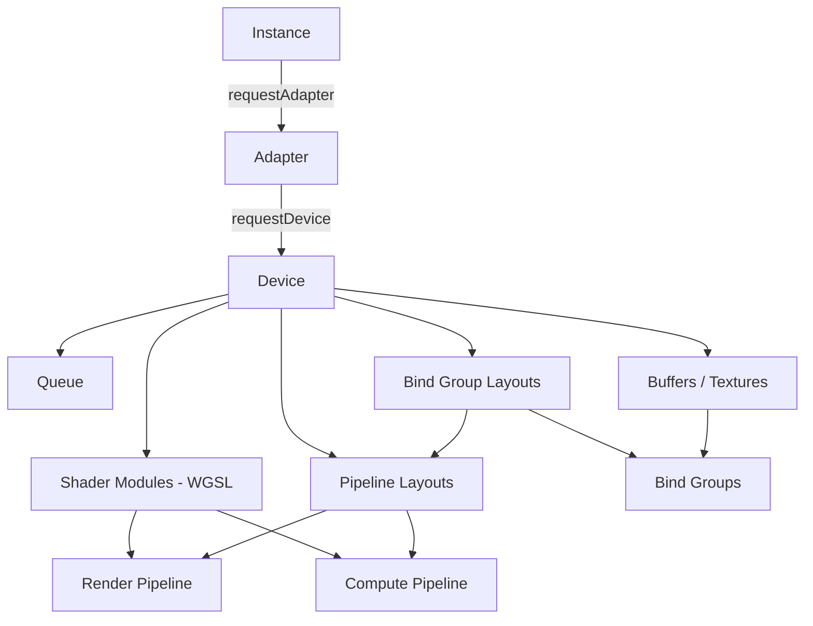
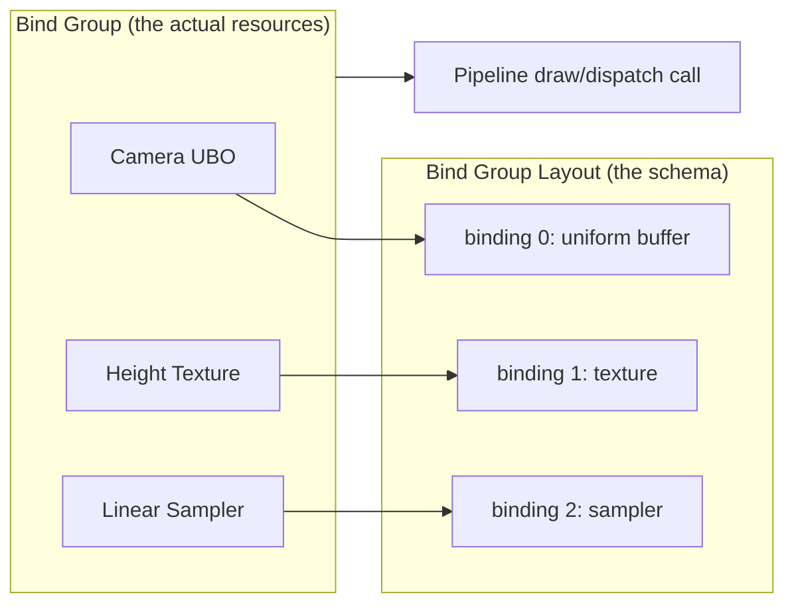
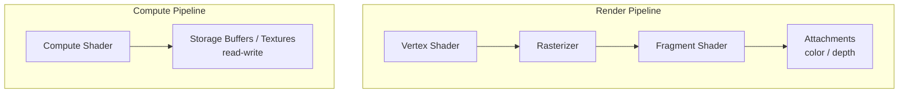
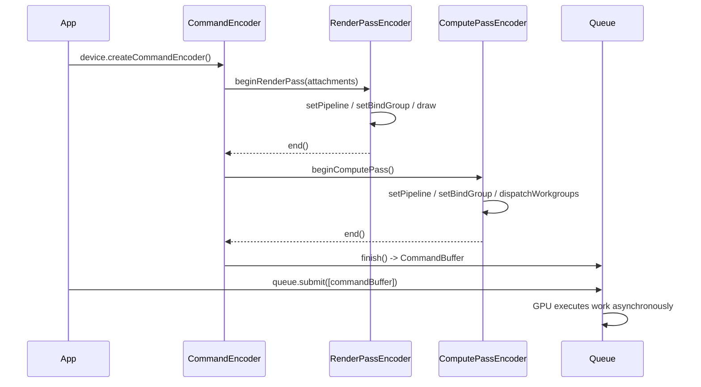
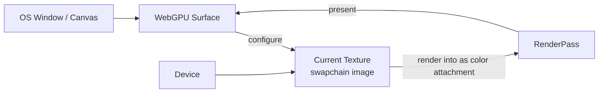
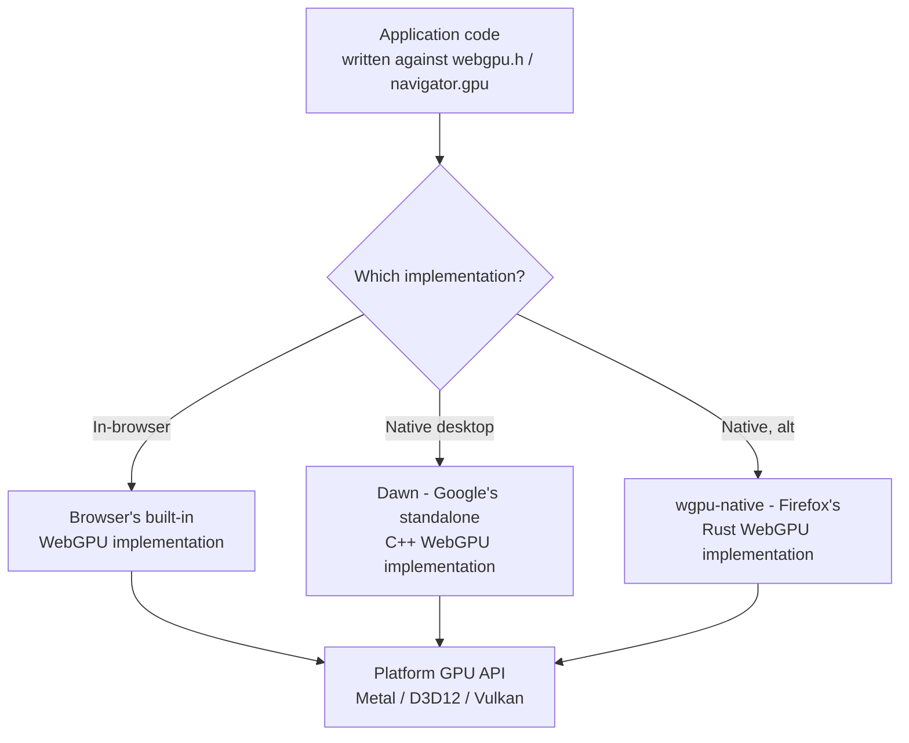
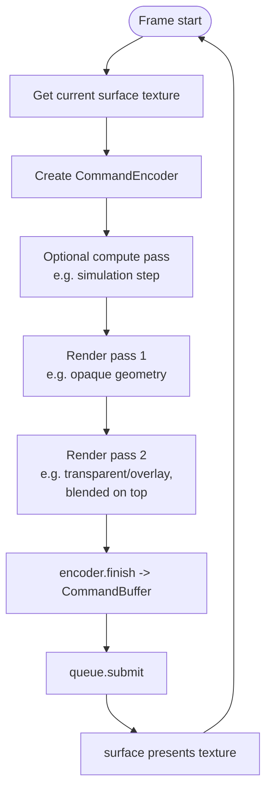

# WebGPU — general overview

A rough map of how WebGPU is structured and what talks to what, independent of any
specific codebase. WebGPU is a fairly explicit, low-level graphics/compute API — the
spiritual successor to Vulkan/Metal/D3D12's "explicit" generation, exposed with a
browser-friendly API (and, same API, usable natively via implementations like Dawn or
wgpu-native).

## 1. The object hierarchy

Everything in WebGPU is created by narrowing down from one root object to the thing
you actually want to draw/compute with. It's a strict chain — you can't skip a level.

- **Instance** — the entry point. Basically "give me access to WebGPU at all."
- **Adapter** — represents one physical/logical GPU on the system (a laptop might
  expose an integrated + a discrete GPU as two adapters). You inspect its limits and
  features here before committing to it.
- **Device** — the logical connection you actually allocate resources and issue work
  through. Requested from an adapter, optionally requesting specific features/limits.
  Almost everything else hangs off the device.
- **Queue** — where finished work actually gets submitted to the GPU. A device
  typically exposes one default queue.

## 2. Data: buffers, textures, and how the GPU sees them

- **Buffer** — an untyped block of GPU memory (vertex data, index data, uniform
  data, storage data for compute). CPU-side you decide the layout; the GPU just sees
  bytes.
- **Texture** — GPU-native image data (2D/3D/array/cube), with a defined format
  (`rgba8unorm`, `depth24plus`, etc.) so the GPU can filter/sample it properly.
- **Sampler** — describes *how* a texture gets read in a shader (filtering, wrap
  mode, mipmapping) — separate object from the texture itself, so one sampler can be
  reused across many textures.
- **Bind Group** — the actual "here are the resources for this draw/dispatch" object:
  a fixed set of buffers/textures/samplers bound to specific slots, matching a
  **Bind Group Layout** (the schema) that both the pipeline and the bind group agree
  on. This indirection (layout as a separate object from the actual bound resources)
  is what lets you swap resources between draw calls cheaply without re-describing
  the whole binding scheme every time.

## 3. Shaders: WGSL

WebGPU's own shading language is **WGSL** (WebGPU Shading Language) — one language
for both vertex/fragment (render) and compute shaders, compiled from a single
`ShaderModule`. A shader module is just parsed/validated WGSL text; a *pipeline*
is what actually picks specific entry points out of it and wires them to real
buffers/textures via a pipeline layout.

Native (non-browser) implementations don't run WGSL directly on the GPU — they
translate it to whatever the underlying platform actually understands:

| Platform | Underlying API | WGSL gets translated to |
|---|---|---|
| macOS/iOS | Metal | MSL (Metal Shading Language) |
| Windows | D3D12 | HLSL |
| Linux/Android | Vulkan | SPIR-V |
| Browser (any OS) | the browser's own native backend | same translation, done inside the browser's GPU process |

This translation step is why WGSL-vs-target-language name collisions or codegen
differences can be platform-specific bugs — the WGSL source is identical everywhere,
but each backend is compiling a *different generated shader*.

## 4. Two kinds of work: render pipelines vs. compute pipelines

- **Render pipeline**: the classic rasterization pipeline — vertex shader transforms
  geometry, the rasterizer turns triangles into fragments, fragment shader computes
  per-pixel color, results land in color/depth **attachments** (usually a texture
  you'll display or use later). Fixed-function state (blending, depth test, culling,
  primitive topology) is baked into the pipeline object itself, not set dynamically —
  a deliberate WebGPU design choice for predictable performance (each distinct
  combination of state is its own compiled pipeline object).
- **Compute pipeline**: a single shader stage, no rasterizer, no fixed geometry
  pipeline — just a workgroup grid of shader invocations reading/writing buffers and
  storage textures directly. This is what general-purpose GPU (GPGPU) work uses —
  physics sims, particle systems, image processing, anything that isn't "draw
  triangles to a screen."

Both kinds of pipeline get *recorded* via encoders and *executed* via passes:

Key idea: **recording commands is separate from executing them.** You build up a
`CommandEncoder`, open one or more passes on it (render or compute, and you can
interleave several of each in one encoder), and nothing touches the GPU until you
`submit()` the finished command buffer to the queue. This lets an app freely mix
several compute passes (e.g., a physics step) and several render passes
(e.g., terrain → clouds → UI overlay, layered on top of each other) within a single
frame, fully under app control — the pipeline doesn't enforce a fixed
"one compute pass then one render pass" structure at all; a frame is just however
many passes you choose to encode before submitting.

## 5. The surface: getting pixels on screen

A `Device`/`Queue` alone can produce texture data, but to actually show something in
a window you need a **Surface** — the interop point between WebGPU and the OS's own
windowing/compositing system. In the browser this is a `<canvas>`; natively it's
whatever the OS's window handle needs wrapped in (e.g. a Metal `CAMetalLayer` on
macOS, an `HWND`-backed swapchain on Windows, an `xcb`/Wayland surface on Linux).

You `configure()` the surface once (format, size, present mode), then each frame you
ask it for the "current texture" to render into as your render pass's color
attachment, and at the end of the frame the surface presents it. Resizing the window
means reconfiguring the surface, not creating a new one from scratch.

## 6. Native vs. browser: same API, different plumbing underneath

The API surface (`webgpu.h` for native C/C++, `navigator.gpu` for JS) is the same
regardless of which implementation sits underneath — that's the entire point of the
spec. Dawn and wgpu-native exist so that C++/Rust applications can use WebGPU without
a browser at all, running as normal native executables. A WASM build compiled with
Emscripten typically calls into the *browser's* WebGPU when it runs (since it's
executing inside a browser's JS engine) — Dawn can also be compiled to WebAssembly
itself as a fallback/polyfill layer for targets without native browser WebGPU
support, but the common path is: native app → Dawn → platform GPU API, WASM app →
browser's own WebGPU → platform GPU API. Either way, the same WGSL shaders and the
same app-level pipeline/bind-group code work unmodified across all of them — that
portability is the reason to pick WebGPU as a native app's graphics API in the first
place, not just "because it's the web standard."

## 7. Putting a frame together, end to end

That loop — acquire surface texture, encode whatever compute/render passes the frame
needs, submit, present, repeat — is the shape of essentially every WebGPU
application, whether it's a browser demo or a full native app.
